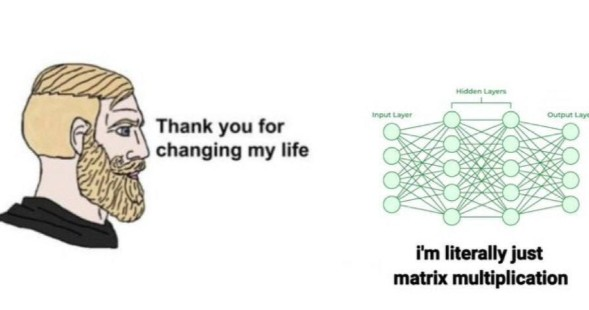

#### Hi, I'm Kevin — I'm always open to interesting collaborations, or just a good technical chat about AI and deep learning.  
If you have something in mind or just want to connect, feel free to reach out!

🎓 Currently pursuing an MSc in Artificial Intelligence & Robotics at *Sapienza University* of *Rome*  
💻 BSc in **Computer Engineering** from *University of Pisa*  

---

### 📫 Contact

-  Email: gianandreak79@gmail.com

  

